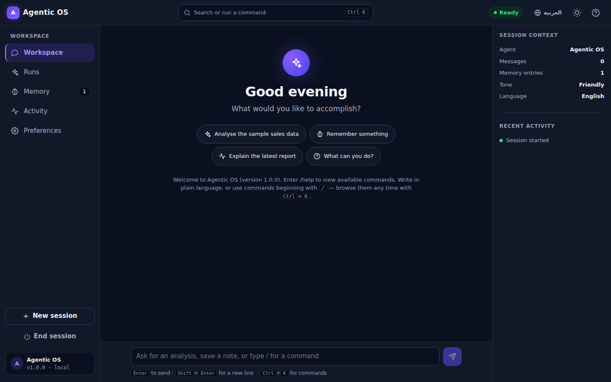

# Agentic OS

An interactive intelligent assistant with two front doors: a modern web
workspace and the original command-line interface. The agent understands
commands, applies your preferences, keeps conversation history, and
remembers information between sessions.

In this project, "operating system" means an intelligent assistant
environment — not a replacement for Windows, macOS, or Linux.



## Main Features

- **Web workspace** — a responsive React application with a greeting hero,
  conversation view, centered command search and palette (Ctrl/⌘+K),
  activity timeline with session health, onboarding, and a token-based
  design system with dark, light, and system themes
- **Command-line interface** — the original `python main.py` experience,
  fully preserved and dependency-free
- **One brain, two faces** — both interfaces drive the same tested Python
  `Agent` class; no logic is duplicated in the frontend
- **All four business-analytics types, one agent each** — Descriptive
  (*what happened?*), Diagnostic (*why?*), Predictive (*what will
  happen?*), Prescriptive (*what should I do?*), running as a maturity
  ladder where each consumes the one below it. **Each produces its own
  report**, plus a comprehensive report embedding all four. Every type
  opens with a headline in plain business language — "Revenue is up 45%
  over the period", not "the mean increased by 2.3 standard deviations" —
  and statistical jargon in a claim or headline **fails validation**
- **Association is never reported as cause** — a dedicated Experiment and
  Causal Inference agent decides whether the data is *entitled* to a
  causal claim. Where rows record assignment to a control and a treatment
  group it compares them, reports each difference as a **range** rather
  than a falsely precise number, widens that range when several groups are
  compared, and flags a split too lopsided to have been random. Where they
  do not — which is most business data — it refuses the causal claim and
  computes the experiment that would settle it: how many observations per
  group, and the smallest change the data already in hand could detect
- **Every figure says what it measures and who owns that definition** —
  a metric glossary (`metrics.json`) gives each metric a definition, an
  owner, and optionally the arithmetic it must satisfy. The glossary
  decides which column a run analyses; where it says nothing, the run
  states plainly that its measure is undefined, and **validation fails a
  run that stays quiet about it**. Where a definition is arithmetic over
  columns present in the data — `revenue = unit_price × units` — every
  row is checked against it and the ones that disagree are named
- **Twenty-one governed specialists, orchestrated by Hermes** — planning,
  ingestion, data contract, profiling, quality scoring, privacy scanning,
  cleaning, metric governance, preparation, segment concentration, the
  four analytics agents, causal inference, anomaly detection, sensitivity
  testing, visualization, provenance, independent validation, and
  reporting, then an approval-gated publish. **Hermes sequences them and holds the gate; it
  analyses nothing itself**, which is what keeps "no stage approves its
  own work" structural. Every stage computes something no other stage
  computes (ADR 0009–0011). Runs are durable, bounded tasks: pause,
  cancel, restart recovery, truthful SVG charts, and a report where
  **every claim links to a calculation**. Forecast accuracy is measured by backtesting, and a
  forecast that could not be tested says so
- **Approval-gated publishing** — reports publish into an
  **Obsidian-compatible vault** (`vault/`) with provenance frontmatter and
  run-log backlinks, only after explicit approval bound to the exact
  artifact hash
- **Provider-neutral model gateway** — deterministic by default (tests and
  CI never need credentials); optional narration by a **local Ollama
  model**, **Claude**, or **Groq**, configured server-side. Local is
  preferred when set because nothing leaves the machine. The model only
  phrases already-verified facts: it never sees the dataset and never
  produces a number, and the report names which narrator wrote the summary
- **Installable PWA** — manifest, icons, and a service worker make the
  mobile-first app installable on Android via "Add to Home screen"
- **Session restore** — refreshing the browser reconnects to the same
  conversation (sessions expire when the server restarts; saved memory
  does not)
- **Memory belongs to its owner** — in hosted mode each tenant's memory
  is scoped to them in the database, and the tests are written from the
  attacker's side of that boundary: a second authenticated user must not
  read, overwrite, or delete the first one's. Until ADR 0014 they could
  do all three
- **Persistent memory** in `data/memory.json` that survives restarts, with
  **categories and timestamps**, search, category filters, add, **in-place
  edit**, delete, and delete-all controls — destructive actions always
  require confirmation (old plain-text memory files load transparently)
- **Data controls** — export everything (memory, preferences, history,
  transcript) as JSON, clear history, or delete all memory from one place
- **Preferences** (tone, your name, language, history recording) applied to
  responses immediately, plus interface settings (theme, reduced motion)
- **Responsive by design** — sidebar navigation on desktop, a bottom tab
  bar on phones and tablets, verified from 320 px up
- **Production-quality states** — skeleton loading, empty, success, error,
  offline, and retry paths for every workflow, plus a filterable activity
  timeline (System / Memory / Preferences / Errors)
- **Continuous integration** — a GitHub Actions workflow runs the entire
  Python, unit, build, and end-to-end suite on every push
- **Accessibility** — WCAG 2.2 AA verified by automated axe scans plus
  keyboard review; full keyboard operation, focus-trapped dialogs,
  reduced-motion support (system setting and in-app switch)
- **Measured performance** — Lighthouse (mobile emulation, production
  build): Performance 96, Accessibility 100, Best Practices 100, SEO 100;
  LCP 2.3 s, CLS 0, TBT 0 ms

## Architecture

```
Browser (React + TypeScript + Vite SPA — frontend/)
   │  JSON over HTTP (typed contracts, timeouts, central error handling)
   ▼
FastAPI adapter (server/app.py) — sessions, validation, safe errors,
CORS, static hosting of the built frontend
   │  direct in-process calls
   ▼
Agent class (agent.py) + utils.py + config.json + data/memory.json
   ▲
   └── Command-line interface (main.py) uses the same Agent directly
```

The adapter contains no business logic: every web operation maps onto the
Agent's tested command surface (`/remember`, `/forget`, `/set`, `/clear`)
and returns fresh state snapshots.

## Directory Structure

```text
├── main.py                # CLI entry point
├── agent.py               # The Agent class (commands, memory, preferences)
├── utils.py               # Config loading, JSON persistence, validation
├── server/                # FastAPI adapter, run engine, storage, auth,
│                          # backup/restore
├── scripts/               # serve.py · backup.py · restore.py · worker.py
│                          # · sbom.py · erase.py
├── config.json            # User-editable settings
├── metrics.example.json   # Metric glossary template (copy to metrics.json)
├── data/memory.json       # Persistent memory (starts empty)
├── tests/                 # Python unittest suite (agent, utils, API,
│                          # runs, analytics, metric glossary, auth,
│                          # quotas, backups, worker, failure injection,
│                          # tenancy, erasure, supply chain, model
│                          # gateway, launcher, docs)
├── frontend/
│   ├── src/
│   │   ├── app/           # Shell, store, theme
│   │   ├── features/      # chat, commands, memory, preferences,
│   │   │                  # activity, onboarding
│   │   ├── shared/        # api client, types, components, styles (tokens)
│   │   └── tests/         # Vitest unit tests
│   └── e2e/               # Playwright end-to-end + accessibility tests
├── docs/
│   ├── UI_UX_AUDIT.md     # Audit, plan, and acceptance criteria
│   ├── adr/               # Decision records (database, auth, analytics…)
│   └── screenshots/       # Final interface captures
├── README.md · user_guide.md · requirements.txt · .env.example
```

## System Requirements

- Python 3.10+ (CLI alone needs only the standard library)
- Node.js 20.19+ or 22+ and npm (web interface only)
- No API keys, no external services, no credentials required. Optional
  narration by a local Ollama model (`OLLAMA_MODEL=qwen3:4b`, no key), Claude
  (`ANTHROPIC_API_KEY`), or Groq (`GROQ_API_KEY`) — all server-side, see
  `.env.example`

## Installation

```bash
git clone https://github.com/ahmadzayan-hub/11.git
cd 11
git checkout claude/agentic-os-final-project-53j6ql

# Web interface dependencies
pip install -r requirements.txt
cd frontend && npm install && npm run build && cd ..
```

## Running the Application

**Web interface (recommended):**

```bash
python scripts/serve.py
```

Then open <http://localhost:8000>. The server hosts both the API and the
built frontend. The launcher also prints an address for **a phone on the
same Wi-Fi** (`http://192.168.x.x:8000`) — with the consequence stated,
because binding to the network is a real decision: local mode has no
login, so anyone on that network can read and change the saved memory.
Use `--local-only` on a network you do not trust, and `--port 9000` if
8000 is taken.

"Add to Home screen" needs HTTPS on most phones, so the *installable* app
comes from a deployment rather than from a laptop on the local network;
over plain HTTP the app still runs fine in the phone's browser.

`python -m uvicorn server.app:app --port 8000` remains equivalent — the
launcher only adds the address detection and the warning.

**Development mode** (hot reload, two terminals):

```bash
python scripts/serve.py --reload                        # terminal 1
cd frontend && npm run dev                              # terminal 2 → http://localhost:5173
```

**Command-line interface:**

```bash
python main.py
```

## Testing

```bash
# Python: agent, utils, API, runs, analytics, metrics, auth, tenancy,
# erasure, quotas, backups, worker, recovery, supply chain, launcher,
# docs (400 tests)
python -m unittest discover tests

# Frontend unit tests (23 tests)
cd frontend && npm test

# End-to-end + accessibility (38 checks across desktop and mobile;
# requires the production build: npm run build)
cd frontend && npx playwright test

# Type checking
cd frontend && npm run typecheck
```

The same suite runs automatically in CI (`.github/workflows/ci.yml`) on
every push, including the run-engine and backup suites against a real
PostgreSQL 16 service. Last verified: 400 Python tests, 23 frontend unit
tests, and 38 end-to-end checks (37 executed, 1 desktop-only check
skipped on the mobile project). In environments with a pre-installed
browser, point Playwright at it:
`PLAYWRIGHT_EXECUTABLE_PATH=/path/to/chromium npx playwright test`.

## Background worker (optional)

Runs advance while the Runs view is open. To advance them with no browser
open, run a worker:

```bash
python scripts/worker.py          # poll for work until Ctrl-C
python scripts/worker.py --once   # advance one run, then exit
```

The worker claims a run with a database lease, advances it one task at a
time, and releases the lease when the run needs a human or ends. It never
decides an approval — it stops at the gate like any other caller. A
worker that crashes stops renewing its lease, and the next worker (or an
open browser) picks the run up from its durable state — including the
stage the crash interrupted, which is re-run rather than skipped. Details
and trade-offs: `docs/adr/0006-durable-execution.md`.

## Failure injection

`tests/test_recovery.py` breaks things on purpose and asserts the run
still reaches the approval gate: the database connection is closed
underneath a lease claim, the server hangs up mid-heartbeat
(`pg_terminate_backend`), a real worker process is killed with SIGKILL
mid-stage, and the engine is thrown away and rebuilt mid-run. It runs in
CI against PostgreSQL like the rest.

These drills found three defects that reasoning had not: the lease
statements never reconnected, the reconnect caught only one of the two
ways a connection dies, and a crash *during* a stage left that stage
marked running forever — so the run continued without it and failed later
with an unrelated error. A full database outage
(`pg_ctl stop -m immediate`) was executed by hand with measured recovery
times, because CI's database is a service container a test cannot stop.
Findings and numbers: `docs/adr/0012-business-continuity.md`.

## Erasing one owner

```bash
python scripts/erase.py --owner alice@example.com          # survey only
python scripts/erase.py --owner alice@example.com --yes    # delete
```

Removes that owner's sessions, runs, tasks, approvals, artifacts,
datasets, vault notes and memory — **and the published markdown files on
disk**, because a report exists in two places and deleting only the
database row turns "erased" into a false statement. The survey is the
default: the operation is irreversible and the owner identifier is a
string somebody typed.

Every report ends with what the command could **not** reach — backups
first, since they still contain the rows and restoring one restores
them. That list prints whether or not anything was found, because
"nothing here" and "nothing anywhere" are different answers. Details:
`docs/adr/0015-per-owner-erasure.md`.

## Supply chain

```bash
python scripts/sbom.py            # → sbom.json (CycloneDX), plus a summary
python scripts/sbom.py --check    # also fail on a shipped copyleft licence
```

Every third-party GitHub Action is pinned to a **commit SHA**, never a
tag: `actions/checkout@v4` before and after a compromise of that
repository are the same line of YAML running different code, with a token
that can write here. The release is named in a comment so an upgrade
stays a readable diff, and a test fails the build if a pin reverts to a
tag or loses its comment.

The bill of materials is generated on every CI run and kept as an
artifact. It covers both ecosystems — npm from the lock file with
integrity hashes, Python from the closure `requirements.txt` actually
reaches — and needs no network, because an SBOM you cannot read during an
incident is not worth having. Current composition: **302 components (275
npm, 27 pypi); 286 permissive, 16 weak-copyleft, none strong**, of which
exactly one copyleft package ships (`psycopg2-binary`, LGPL with
exceptions) and is named in the build output every time. Details:
`docs/adr/0013-supply-chain.md`.

## Backup and restore

```bash
python scripts/backup.py                      # → backups/agentic-<utc>.json
python scripts/restore.py <file> --dry-run    # inspect without writing
python scripts/restore.py <file> --yes        # replace the database
```

Both honour `DATABASE_URL` (hosted PostgreSQL) and fall back to the local
SQLite database. A backup is one dialect-neutral JSON document, so a
local backup restores into hosted PostgreSQL — which is also the
supported way to move an existing install to a server. Restore replaces
the database rather than merging into it, and refuses an unreadable or
unknown-version file before deleting anything.

`tests/test_backup.py` is a genuine drill, not a file check: it destroys
the database and rebuilds it through these scripts, then asserts the runs,
evidence, approval decisions, published notes, sessions, and datasets
survived — and that a restored run can still be advanced to completion.
It runs against both SQLite and PostgreSQL on every push. Measured times
and the RPO/RTO position are in `docs/adr/0005-backup-and-restore.md`;
in local mode remember that `data/memory.json` sits outside the database
and needs backing up alongside it.

## Basic Usage Example (web)

1. Open the app — a short onboarding explains the basics.
2. Type `Hello there` and press Enter, or pick a suggested action.
3. Press <kbd>Ctrl</kbd>+<kbd>K</kbd>, choose `/remember`, and save a fact.
4. Open **Memory** to search, edit, delete, or export what's saved — the
   **Data controls** card also clears history or deletes all memory, always
   with a confirmation step.
5. Open **Preferences**, switch the tone to *Concise* (replies change
   immediately), and set your name for a personal greeting.
6. Check **Activity** for the event timeline and session health, and use
   **End session** in the sidebar to close gracefully.

The same commands work in the CLI:

```text
Welcome to Agentic OS (version 1.0.0). Enter /help to view available commands.
You: /set tone concise
Agent: Preference updated: tone = concise.
You: /remember My preferred language is English.
Agent: Information saved.
You: /history
Agent: /set tone concise
       /remember My preferred language is English.
```

See `user_guide.md` for the full command reference.

## Security and Privacy

- Memory is stored as plain text in `data/memory.json` on your own
  computer; nothing is sent to any external service. Remove entries from
  the Memory panel, with `/forget`, or by deleting the file.
- The repository contains no secrets; `.env.example` documents the few
  optional environment variables (all with safe defaults).
- The API validates input lengths and shapes, restricts CORS, hides stack
  traces, and requires confirmation in the UI before destructive actions.

## Known Limitations

- The agent recognizes commands and produces tone-styled acknowledgements
  for free text; it does not use an AI language model.
- Preference changes apply to the current session; permanent defaults are
  edited in `config.json`.
- Sessions survive both a browser refresh and a server restart: the
  conversation, its preferences, and its history are stored durably
  (SQLite locally, PostgreSQL when `DATABASE_URL` is set).
- Local mode runs single-user with no login. Hosted mode verifies a
  managed provider's tokens with server-side roles and per-owner
  isolation; the live provider round-trip has never been executed here.
- Nothing schedules backups: `scripts/backup.py` runs when someone runs
  it. See `docs/KNOWN_LIMITATIONS.md` for the full list.

## Future Improvements

- Persist preference changes back to `config.json` on request
- Streamed responses and a pluggable AI-model backend
- A scheduled off-site backup job (see ADR 0005 for why it is not a
  workflow in this public repository)
- Named memory keys (e.g. `/remember birthday = 1 May`)

## Author and Course Information

- Author: Ahmad Zayan
- Course: Agentic OS Final Project
- Version: 1.0.0
